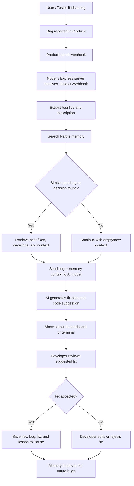

```mermaid
flowchart TD
    A["User / Tester finds a bug"] --> B["Bug reported in Produck"]

    B --> C["Produck sends webhook"]
    C --> D["Node.js Express server receives issue at /webhook"]

    D --> E["Extract bug title and description"]

    E --> F["Search Parcle memory"]
    F --> G{"Similar past bug or decision found?"}

    G -- "Yes" --> H["Retrieve past fixes, decisions, and context"]
    G -- "No" --> I["Continue with empty/new context"]

    H --> J["Send bug + memory context to AI model"]
    I --> J

    J --> K["AI generates fix plan and code suggestion"]

    K --> L["Show output in dashboard or terminal"]
    L --> M["Developer reviews suggested fix"]

    M --> N{"Fix accepted?"}

    N -- "Yes" --> O["Save new bug, fix, and lesson to Parcle"]
    N -- "No" --> P["Developer edits or rejects fix"]

    O --> Q["Memory improves for future bugs"]
    P --> Q
```